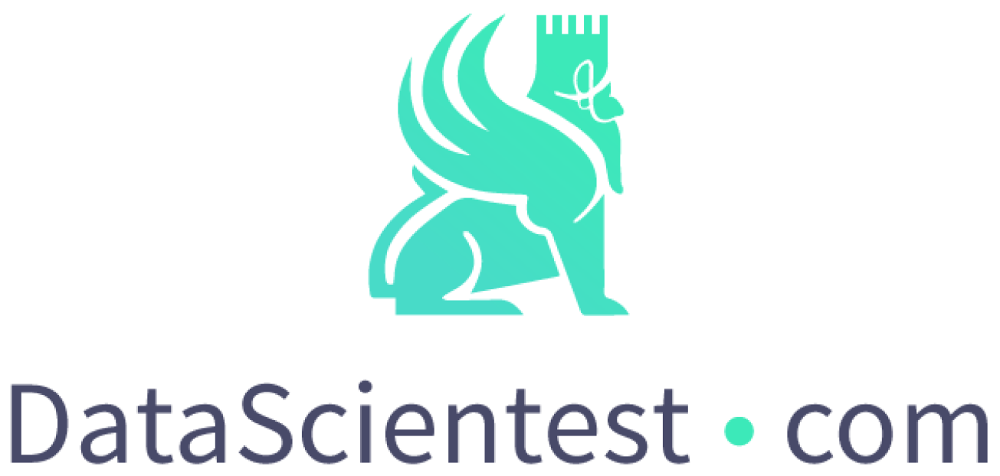

# Cahier des charges projet MLOps tradingbot.fr

## 1) Contexte et Objectifs

## Introduction

Ce projet à pour vocation de développer une API permettant aux utilisateurs d'obtenir des prédictions sur des actifs boursiers. Les actifs utilisés se limiteront à environ 500 sociétés cotées sur le marché américains. Dans un premier temps, le projet sera développé en local avec pour objectif de l'intégrer dans un serveur Cloud. Ce serveur a déjà été monté, il heberge une base de donnée phpmyadmin et un nom de domaine a été acquis (tradingbot.fr).

- ### A quelle problématique l’application doit-elle répondre ?

    Contexte :  Trading en position “swing trading” sur la base des cours de clôture sur des actions boursières. Ce qui signifie de devoir prendre des décisions d’achat ou de ventes (y compris ventes à découvert) en se basant sur les cours de clôture des marchés boursiers plutôt que sur les fluctuations intraday des cours. L‘objectif est de profiter des mouvements de prix pour générer une plus-value.

    ### Problématiques :  

    - ll existe plus de 600 000 actions cotées dans le monde, réparties sur plus de 100 bourses dans plus de 80 pays. 

    - Il est communément admis qu'une personne seule et expérimentée peut suivre sans aide logicielle, un portefeuille d'environ 20 à 30, (en  fonction de la complexité de sa stratégie de trading, de la fréquence du trading, et de la quantité d'informations à analyser)

    - Dans ce contexte l'utilisation d'un logiciel de trading capable d’analyser rapidement  de grandes quantités de données, permet d’élargir les opportunités  parmi un nombre bien plus grand d'actions. Ce qui rend possible la mise en place de stratégies de trading plus complexes. 

    - La gestion du risque et de l’horizon d’investissement sont capitales pour construire un portefeuille. De la diversification des investissements et la gestion de la liquidité et la répartition du capital sur un certain nombre d'actions dépend la sécurité des investissements. L’aide apportée par un système intelligent capable d’analyser un nombre colossale de données de cours et/ou fondamentales permet de réduire les risques et de maximiser les chances de réaliser des bénéfices à long terme. 

    - La rentabilité ne dépend aussi des coûts : frais de courtage, coûts associés au trading, fiscalité...

        

    ### 			différents niveaux envisagés en fonction de l’avancé du projet :

    - **Niveau 1- Sur quels actions placer un ordre d’achat ou de vente (y compris à découvert) à l’instant de ma requête ?**  => proposition d’une liste ordonnée des choix possibles
    - **Niveau 2- Avec quel ordre précisément ?** en fonction de l’horizon d’investissement pour optimiser les propositions => (courts, volume, type, date des validité) des ordres à passer acheter / garder  /vendre / stop loss... tenir compte de la probabilité de réalisation de l’ordre
    - **Niveau 3- proposition faite en prenant en compte la composition du portefeuille de l’utilisateur** (faire entrer et sortir des valeurs)
    - **Niveau 4- En optimisant la composition du portefeuille ?** gestion des risques : minimiser les risques et maximiser les gains.
    - **Niveau 5- En prenant en compte les coûts** (frais, taxes, impôts ?) 

    

- ### Qui est le commanditaire de l’application ?

    Réalisé dans le cadre de notre formation de MLOps avec DataScientest
	-> ou : commandité par un courtier pour ses clients ou par un gérant de fonds

- ### Qui sera l’utilisateur de l’application ?

    L’application s’adresse à des tradeurs particuliers, qui n’ont pas la puissance des outils financiers mis à dispositions des tradeurs institutionnels et professionnels et qui désirent pouvoir augmenter leur scope pour détecter des opportunités d’investissement en action. (et minimiser les risques)
	Et gérant d'actifs actions qui souhaitent une aide à la décision quant à la gestion de leur portefeuille.

- ### Qui sera l’administrateur de l’application ?

    - Application administrée par notre groupe

    - utilisateurs :

        - création des comptes utilisateurs automatisés

        - modification des comptes par l’utilisateurs
        - gestion des licences / abonnements

    - gestion des données financières (cours, fondamentales...) (vérification et prétraitement des données)

    - gestion des modèles  (entraînement, mises en productions)

- ### Dans quel contexte l’application devra-t-elle s’intégrer (site web, software,
  serveur cloud…) ?

  Niveau 1 : site web / optionnel : +/- prototype application androïde

  Niveau 2 : serveur Cloud

- ### Via quel support l’application sera-t-elle utilisée (interface graphique, terminal,
  API…) ?

  Niveau 1 :  API

  NIveau 2 : interface graphique site internet

  Niveau 3 : alertes mail
  
  Niveau 4 : alertes SMS
  
  
## 2) Modèle

- ### Type de modèle employé
  Le modèle uilisé visera donc à prédire la variation de cours des actions à plusieurs horizons de temps et avec différents types de données d'entrée.
  Nous employons ici un **modèle de régression LightGBM**. A l'instar du fameux XGBoost, ce dernier est basé sur un modèle d'apprentissage d'ensemble séquentiel, créé par des chercheurs de Microsoft, se basant sur le renforcement de gradient et des arbres de décision (GBDT ou Gradient Boosting decision Trees). Il tend d'ailleurs à le remplacer comme modèle phare des challenges de DataScience comme Kaggle.
  Dans ces modèles, les arbres de décisions sont combinés de manière à ce que chaque nouvel apprenant ajuste les résidus de l'arbre précédent afin que le modèle s'améliore. Le dernier arbre ajouté regroupe les résultats de chaque étape et un apprenant puissant est atteint.
  Mais LightGBM vise à résoudre le problème du temps et de la puissance de calcul pour la construction des arbres de l'algorithme CART, en introduisant les notions de GOSS (Gradient-based One-Side Sampling ou échantillonnage d'un côté en dégradé) et EFB (Exclusive Feature Bundling ou Offre groupée de fonctionnalités exclusives).
  Ce modèle a donc été choisi pour ses performances : il est beaucoup plus rapide que XGBoost et moins sujet au sur-apprentissage sur de grandes quantités de données.

  Etant donné qu'on souhaite proposer des modèles basés sur différentes entrées, ils seront entraînés sur trois types de jeux de données :
  - les **données de marché** uniquement: ouverture, plus haut, plus bas, clôture, volume. Nous calculons ensuite diverses caractéristiques basées sur celles-ci : rendement logarithmique sur différentes périodes retardées, position de la clôture de la veille par rapport à différentes moyennes mobiles, croisement de moyennes mobiles, volatilité historique, variation de volume sur différentes périodes.
  - des **données fondamentales** uniquement (données macroéconomiques et données financières des entreprises) : prix des obligations américaines à 10 ans, variation sur 1 mois de celles-ci, VIX, EPS, ratio cours/bénéfice, PEG ratio, rendement des dividendes, taux de surprise lors des annonces de bénéfices, secteur, etc...
  - à la fois sur les **données de marché** et les **données fondamentales**.

  Nous souhaitons également proposé des prédictions à différents horizons de temps pour coller aux besoins des utilisateurs. Les modèles seront donc entraînés pour faire des prédictions à :
  - un jour
  - une semaine
  - deux semaines
  - un mois
  
  Comme nous récupèrerons les prix de clôture de la veille, tous les modèles sont en fait entraînés pour prédire l'horizon en **question + 1 jour**.

  **<u>Performances générales :</u>**
  
  
  
  
  
- ### La définition des métriques d’évaluation du modèle vis à vis des contraintes
du projet (accuracy, robustesse, temps d’entraînement, temps de
prédiction…)
## 3) Base de données

Dans un premier temps, les données seront utilisées via des fichiers .csv.
Un fichier users_bd.csv sera créé pour lister les différents users qui ont accès à l'API ainsi que les autorisations associées à ces users.

Dans un premier temps, la prédiction se fera directement en allant chercher les données à la source, c’est-à-dire :
-	L’api de Tiingo pour les données de marchés
-	Le scrapping du site Zacks.com, du site Yahoo Finance pour les données financières des entreprises
-	L’api du site Yahoo Finance pour les données le prix des obligations américaines 10 ans
-	L’api du site du Chicago Board Exchange pour le VIX
Afin d’accélérer le traitement des demandes, nous envisageons de récupérer ces données quotidiennement pour les stocker dans une base de données.
Cela nous donnera aussi la possibilité de mettre en place un pipeline de réentrainement des modèles, prévu dans un second temps.

Cette base de donnée sera hébergée dans un serveur cloud. L'interface utilisée pour la gestion de la base de donnée sera "phpmyadmin". Elle sera composée de plusieurs tables et sera peuplé de manière journalière à travers des cron.

La base de donnée sera composée des tables suivantes :
    * users => liste des utilisateurs ayant accès à l'API avec leurs accréditations
    * assets => liste des actifs nécessaire au bon fonctionnement des modèles de ML
    * sectors => liste des secteurs associées aux actifs de la table assets
    * financials => données financières fondamentales associées aux actifs de la table assets
    * quotes => cours de bourse quotidien associés aux actifs de la table assets

## 4) API
*L’API est l’interface entre le modèle, la base de données et l’utilisateur. Il n’est pas*
*obligatoire, dans le cadre de ce projet, d’y intégrer une interface graphique. En*
*revanche, cette API devra intégrer une notion d’authentification des différents types*
*d’utilisateurs/administrateurs qui devront l’utiliser.*
*Cette partie doit détailler les différents endpoints que vous souhaitez intégrer à votre*
*API, la manière dont cette dernière fera appel à la base de données, au modèle,*
*écrire dans les logs et éventuellement modifier la base de données.*

* authentification
* admin
* test API / modèles / nombre erreurs...
* visu performances modèles
* visu activités API (nombre de requêtes, nombre utilisateurs... statistiques utilisation)
* prédictions
* visualisation des  bases de données ?
* gestion des bases de données ?
* gestion des utilisateurs ?
* mon portefeuille ?
* mes frais ?
* mon profil investisseur ?

## 5) Testing & Monitoring
*Au cours du déploiement de l’application, il sera nécessaire de porter une attention*
*particulière au fait que les différentes parties du projet fonctionnent correctement*
*individuellement (tests unitaires), et que les performances de l’application soient*
*toujours en adéquation avec le cahier des charges.*
*Cette partie devra détailler les tests unitaires qu’il faudra mettre en oeuvre comme*
*par exemple :*

- ### Tester le bon fonctionnement du modèle lors de l’entraînement
- ### Tester le bon fonctionnement du modèle lors de la prédiction
- ### Tester le bon fonctionnement des différents endpoints de l’API
- ### Tester le bon fonctionnement du process d’ingestion de nouvelles données
Mais également le monitoring du modèle et les décisions qui en découlent :
- ### Comment évaluer la performance du modèle à un instant donné ? (évaluation
sur l’intégralité du jeu de test, évaluation sur les données les plus récentes)
- ### Quand faut-il ré-entraîner le modèle ? (périodiquement, lorsque les
performances sont trop faibles)
- ### Sur quelles données faut-il ré-entraîner le modèle ? (sur l’intégralité du jeu de
données, sur un échantillon des données les plus récentes…)
- ### Que faire lorsque le modèle n’atteint pas le seuil de performance requis ?
(envoyer un mail d’alerte aux personnes concernées, bloquer l’application)
## 6) Schéma d’implémentation
Schéma récapitulatif du projet, les différentes composantes du projet et leurs interactions. 

code couleur compréhensible 

[Schéma d’implémentation](./images_cahier_des_charges/Schema_implementation_V1.8.2d.png) / [pdf](./images_cahier_des_charges/Schema_implementation_V1.8.2d.pdf)

## 7) Projet cloud
Un serveur a été monté dans le Cloud setupé et un nom de domaine a été acheté. Chacun des membre de l'équipe travaille depuis ce serveur. Ce serveur heberge la base de données qui servira au bon fonctionnement de l'API lorsque son fonctionnement sera adapté pour fonctionner dans le Cloud.

L'objectif est de pouvoir présenter une version opérationnelle de l'API dans le cloud, qui communique avec la base de données phpmyadmin qui aura été construite.